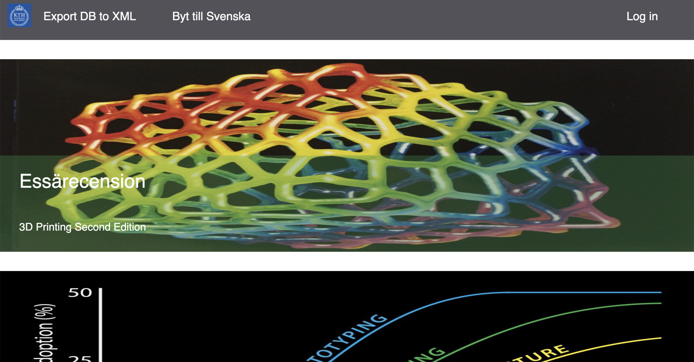

# A Student Blog - My first website

**From this project I learnt vastly in the layers of web development as well as PHP and usage of templating languages.**

### Preview

### Description

This is a repo for the project I did in XML for Publishing in 2015. It was the first website I ever made so it sucks but I'm still a bit happy about it since I learnt so much. Since the website is a blog and was the first project I made which incorporated everything from database to the client. 

This project was later re-written in Laravel as a means to further learn from the field. It is available at the repo [Digital Monkey - A Tech Blog](https://github.com/chrismessiah/digital-monkey)
